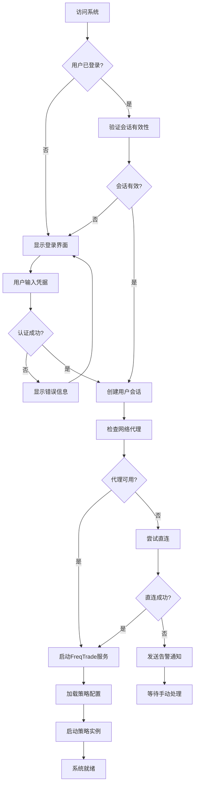
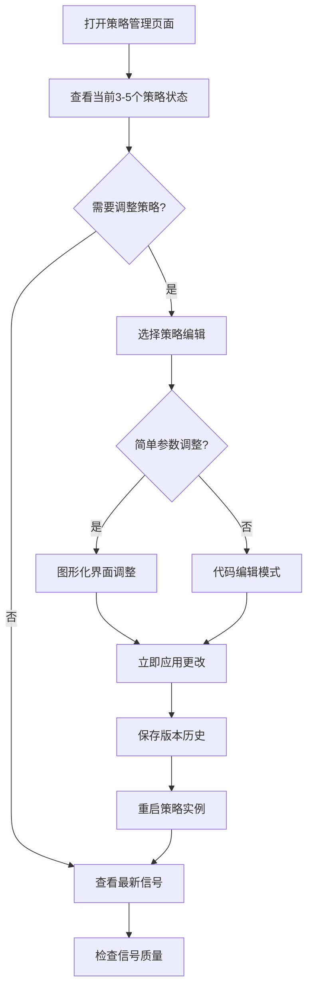
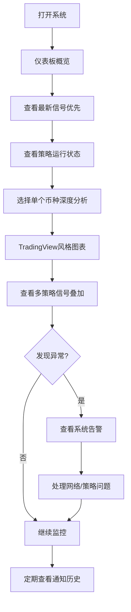
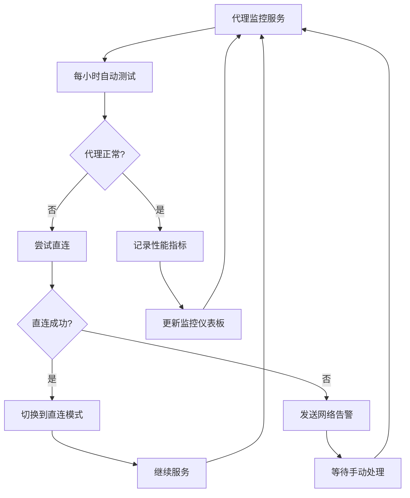

# BTC Watcher 业务流程设计

## 基于用户调研的设计原则

### 🎯 核心用户画像
- **技术背景**: 资深研发工程师，具备代码编写能力
- **交易经验**: 中级交易者（1-3年），关注主流币种
- **使用频率**: 高频用户（每天多次），24小时全时段使用
- **重要性优先级**: 信号质量 > 策略状态 > 图表分析 > 系统告警

### 🔑 关键设计要求
1. **稳定性优先**: 连续运行一周以上，可接受10秒响应时间
2. **混合配置**: 图形化界面 + 高级代码编辑能力
3. **单币种专注**: 深度分析单一币种，而非多币种概览
4. **代理管理核心**: 智能处理网络故障和代理切换
5. **完整通知**: 包含图表截图等详细信息的通知

---

## 核心业务流程

### 1. 系统初始化流程（更新）



### 2. 策略管理主流程



### 3. 日常监控流程



### 4. 代理管理流程



---

## 详细页面功能设计

### 🔐 登录界面（新增）

**设计原则**：简洁安全，不透露系统功能信息

```
┌─────────────────────────────────────────────────────────────┐
│                                                             │
│                                                             │
│                                                             │
│                     ┌─────────────────┐                    │
│                     │                 │                    │
│                     │   用户名/密码    │                    │
│                     │   ___________   │                    │
│                     │   ___________   │                    │
│                     │                 │                    │
│                     │  [  登 录  ]    │                    │
│                     │                 │                    │
│                     │ 语言: 中文 ▼    │                    │
│                     │                 │                    │
│                     └─────────────────┘                    │
│                                                             │
│                                                             │
│                                                             │
│                                                             │
└─────────────────────────────────────────────────────────────┘
```

**功能特点**：
- 极简设计，无系统标识、Logo或功能说明
- 居中的登录框，纯色背景
- 内置语言切换功能（中文/English）
- 记住登录状态（可选）
- 基础的输入验证和错误提示

### 🌐 多语言支持功能

**语言切换机制**：
- 登录页面：语言选择下拉框
- 主界面：右上角语言切换按钮
- 支持中文简体和英文两种语言
- 实时切换，无需刷新页面

**多语言覆盖范围**：
- 所有UI界面文本
- 系统消息和提示信息
- 通知消息内容
- 错误提示和帮助文档

---

## 详细页面功能设计

### 🏠 仪表板页面（Dashboard）

**信息优先级布局**：

```
┌─────────────────────────────────────────────────────────────┐
│ Dashboard                              语言:中文 ▼ [退出]   │
├─────────────────────────────────────────────────────────────┤
│ [1优先] 最新信号区域 (占据页面上方35%)                          │
│ ┌─────────┬─────────┬─────────┬─────────┬─────────┐          │
│ │BTC/USDT │ETH/USDT │ADA/USDT │SOL/USDT │BTC/ETH │          │
│ │买入信号 │卖出信号 │持有     │买入信号 │持有    │          │
│ │$42,500  │$2,250   │$0.85    │$95.50   │0.02895 │          │
│ │强度:85% │强度:72% │-        │强度:91% │-       │          │
│ │2分钟前  │5分钟前  │-        │1分钟前  │-       │          │
│ │[通知✓]  │[通知✓]  │         │[通知✓]  │        │          │
│ └─────────┴─────────┴─────────┴─────────┴─────────┘          │
├─────────────────────────────────────────────────────────────┤
│ [2优先] 策略状态监控 (占据页面中部30%)                          │
│ ┌──────────────┬──────────┬──────────┬─────────┬──────────┐ │
│ │策略名称      │状态      │运行时长   │信号数   │最后信号   │ │
│ │MA_Cross_BTC  │运行中●   │2小时15分  │15       │3分钟前   │ │
│ │RSI_ETH       │运行中●   │1小时45分  │8        │12分钟前  │ │
│ │Custom_SOL    │运行中●   │3小时02分  │22       │1分钟前   │ │
│ │Bollinger_ADA │错误❌    │-         │-        │1小时前   │ │
│ └──────────────┴──────────┴──────────┴─────────┴──────────┘ │
├─────────────────────────────────────────────────────────────┤
│ [3优先] 通知状态和最近通知 (占据页面中部20%)                    │
│ ┌─通知状态─────────────┬─最近通知─────────────────────────┐ │
│ │短信: 连接正常 ●      │14:25 BTC买入信号 → 短信 ✓       │ │
│ │飞书: 连接正常 ●      │14:22 策略状态异常 → 飞书 ✓      │ │
│ │微信: 连接正常 ●      │14:18 代理连接问题 → 短信 ✓      │ │
│ │邮件: 连接正常 ●      │14:15 ETH卖出信号 → 微信 ✗       │ │
│ │                    │[查看全部通知历史]               │ │
│ └────────────────────┴─────────────────────────────────┘ │
├─────────────────────────────────────────────────────────────┤
│ [4优先] 系统状态栏 (占据页面底部15%)                           │
│ 网络: 代理连接正常 ● | FreqTrade: v2024.1 ● [有更新🆙] | 数据更新: 2秒前 │
│ 内存: 2.5GB | CPU: 45% | 最后备份: 昨天 23:00 | [系统设置]        │
└─────────────────────────────────────────────────────────────┘
```

### 📊 图表分析页面（TradingView风格）

**基于单币种深度分析的布局**：

```
┌─────────────────────────────────────────────────────────────┐
│                    BTC/USDT 深度分析                         │
├─────┬───────────────────────────────────────────────────────┤
│币种 │                主图表区域                               │
│列表 │ ┌─────────────────────────────────────────────────────┐ │
│     │ │ 时间周期: [1m] [5m⭐] [15m] [1h] [4h] [1d]          │ │
│BTC  │ │                                                   │ │
│●●●  │ │           K线图 + 技术指标 + 信号标记                 │ │
│     │ │                                                   │ │
│ETH  │ │  Price                                            │ │
│○○○  │ │  43500├──MA20────────────────────────────────     │ │
│     │ │  43000│    ▲(MA_Cross)                            │ │
│ADA  │ │  42500│         ▼(RSI_Combo)      ▲(Custom)      │ │
│○○○  │ │  42000│              ▲(MA_Cross)                 │ │
│     │ │  41500└───────────────────────────────────────    │ │
│SOL  │ │        10:00  11:00  12:00  13:00  14:00        │ │
│○○○  │ │                                                   │ │
│     │ │  Volume                                           │ │
│BTC/ │ │  1000├─────────────────────────────────────      │ │
│ETH  │ │   500│    █     █  █      █                      │ │
│○○○  │ │     0└─────────────────────────────────────      │ │
│     │ └─────────────────────────────────────────────────────┘ │
├─────┼───────────────────────────────────────────────────────┤
│策略 │                信号详情面板                              │
│面板 │ ┌─────────────────────────────────────────────────────┐ │
│     │ │ 当前活跃信号: 3个 | 最新: 1分钟前                      │ │
│MA   │ │ ┌─MA_Cross─┐ ┌─RSI_Combo─┐ ┌─Custom_SOL─┐         │ │
│Cross│ │ │买入 85%  │ │持有 --   │ │买入 91%   │         │ │
│●●●  │ │ │$42,458   │ │$2,251    │ │$95.47     │         │ │
│     │ │ │3分钟前   │ │15分钟前  │ │1分钟前    │         │ │
│RSI  │ │ └─────────┘ └─────────┘ └─────────┘         │ │
│Combo│ │                                                   │ │
│●●○  │ │ 技术指标当前值:                                       │ │
│     │ │ RSI: 68.5 | MACD: 0.25 | BB_Upper: 43,200          │ │
│Cust │ │ MA20: 42,800 | Volume_24h: 28.5K BTC              │ │
│SOL  │ └─────────────────────────────────────────────────────┘ │
│●●●  │                                                       │
└─────┴───────────────────────────────────────────────────────┘
```

### ⚙️ 策略管理页面（混合配置模式）

```
┌─────────────────────────────────────────────────────────────┐
│                    策略管理中心                               │
├─────────────────────────────────────────────────────────────┤
│ 当前策略列表 (3/5个运行中)                                     │
│ ┌──────────────────┬──────────┬──────────┬─────────┬────────┐│
│ │策略名称          │状态      │版本      │信号数   │操作     ││
│ │MA_Cross_BTC_v2.1 │运行中●   │v2.1     │15      │[编辑]   ││
│ │RSI_ETH_Strategy  │运行中●   │v1.3     │8       │[编辑]   ││
│ │Custom_SOL_Combo  │运行中●   │v1.0     │22      │[编辑]   ││
│ │Bollinger_ADA     │错误❌    │v1.2     │0       │[修复]   ││
│ │[+ 新建策略]      │-        │-        │-       │        ││
│ └──────────────────┴──────────┴──────────┴─────────┴────────┘│
├─────────────────────────────────────────────────────────────┤
│ 策略详细配置 (选中: MA_Cross_BTC_v2.1)                        │
│ ┌─基础配置─────────┬─参数配置─────────┬─高级配置─────────┐   │
│ │策略名称:         │快线周期: [10  ]  │[代码编辑模式]   │   │
│ │[MA_Cross_BTC_v2]│慢线周期: [20  ]  │                │   │
│ │                 │                 │```python       │   │
│ │监控交易对:       │信号阈值: [0.5 ]  │def get_buy_    │   │
│ │☑BTC/USDT        │                 │conditions():   │   │
│ │☑BTC/ETH         │止损%:   [2.0  ]  │    # 自定义买入 │   │
│ │☐ETH/USDT        │                 │    # 逻辑代码   │   │
│ │                 │时间周期:         │    return [...] │   │
│ │策略类型:         │[5分钟 ▼]        │```             │   │
│ │[MA交叉策略 ▼]    │                 │                │   │
│ │                 │代理设置:         │[保存代码]      │   │
│ │版本管理:         │[系统代理 ▼]      │[语法检查]      │   │
│ │v2.1 (当前)      │                 │                │   │
│ │v2.0 [回滚]      │实时更新: ☑      │                │   │
│ │v1.3 [回滚]      │通知启用: ☑      │                │   │
│ └─────────────────┴─────────────────┴─────────────────┘   │
│                                                            │
│ [保存并重启] [保存为新版本] [测试策略] [取消修改]              │
└─────────────────────────────────────────────────────────────┘
```

### 🌐 代理管理页面

```
┌─────────────────────────────────────────────────────────────┐
│                    网络代理管理                               │
├─────────────────────────────────────────────────────────────┤
│ 当前代理状态                                                  │
│ ┌─────────────┬─────────┬─────────┬─────────┬──────────────┐ │
│ │代理类型     │状态     │延迟     │成功率   │最后测试       │ │
│ │SOCKS5       │连接中●  │150ms   │95.2%   │2分钟前       │ │
│ │(主代理)     │         │        │        │              │ │
│ │直连模式     │备用     │85ms    │98.5%   │2分钟前       │ │
│ │(备用)       │         │        │        │              │ │
│ └─────────────┴─────────┴─────────┴─────────┴──────────────┘ │
├─────────────────────────────────────────────────────────────┤
│ 代理配置                                                      │
│ ┌─基本设置─────────────────┬─性能监控─────────────────────┐   │
│ │代理类型: [SOCKS5 ▼]      │连接成功率: ████████░░ 85%   │   │
│ │服务器:   [proxy.x.com ]  │平均延迟:   ██████░░░░ 156ms │   │
│ │端口:     [1080       ]  │下载速度:   ███████░░░ 2.1MB │   │
│ │用户名:   [username    ]  │稳定性:     █████████░ 92%   │   │
│ │密码:     [••••••••••• ]  │                             │   │
│ │                         │实时监控图表:                 │   │
│ │故障处理策略:             │延迟趋势 (最近1小时)          │   │
│ │☑ 失效时尝试直连          │200ms├─────────────────────   │   │
│ │☑ 每小时自动测试          │150ms│  ∼∼∼∼∼∼∼∼∼∼∼       │   │
│ │☑ 启动时测试一次          │100ms│                      │   │
│ │☑ 发现问题时立即测试      │ 50ms└─────────────────────   │   │
│ │                         │     12:00 12:30 13:00 13:30│   │
│ └─────────────────────────┴─────────────────────────────┘   │
│                                                            │
│ [测试连接] [保存配置] [切换到直连] [查看详细日志]              │
└─────────────────────────────────────────────────────────────┘
```

### 🔔 通知管理页面

```
┌─────────────────────────────────────────────────────────────┐
│                    通知管理中心                               │
├─────────────────────────────────────────────────────────────┤
│ 通知渠道配置 (按优先级排序)                                    │
│ ┌────────┬──────────┬─────────┬─────────┬──────────────────┐ │
│ │优先级  │渠道      │状态     │最后发送 │配置                │ │
│ │1      │手机短信  │启用 ●  │5分钟前  │[配置API密钥]     │ │
│ │2      │飞书      │启用 ●  │3分钟前  │[配置机器人]      │ │
│ │3      │微信      │启用 ●  │8分钟前  │[配置企业微信]    │ │
│ │4      │邮件      │启用 ●  │1小时前  │[配置SMTP]       │ │
│ │5      │Telegram  │禁用 ○  │-       │[配置Bot Token]  │ │
│ └────────┴──────────┴─────────┴─────────┴──────────────────┘ │
├─────────────────────────────────────────────────────────────┤
│ 通知规则设置                                                  │
│ ┌─通知类型───────────┬─内容设置───────────────────────────┐   │
│ │☑ 买入信号          │☑ 币种和价格                        │   │
│ │☑ 卖出信号          │☑ 信号类型和强度                     │   │
│ │☑ 策略启停状态      │☑ 触发的策略名称                     │   │
│ │☑ 系统错误告警      │☑ 相关技术指标                      │   │
│ │☑ 网络连接问题      │☑ 图表截图                          │   │
│ │☑ 定期运行报告      │                                   │   │
│ │                   │频率控制:                           │   │
│ │时间段设置:         │☑ 有信号就发送，不限频率            │   │
│ │自定义时间段配置    │                                   │   │
│ │工作时间: 9:00-18:00 │失败处理:                           │   │
│ │  - 接收所有通知    │☑ 自动重试发送                      │   │
│ │休息时间: 18:00-9:00 │☐ 尝试其他通知渠道                   │   │
│ │  - 只接收重要通知  │                                   │   │
│ └───────────────────┴───────────────────────────────────┘   │
├─────────────────────────────────────────────────────────────┤
│ 最近通知历史                                                  │
│ ┌─────────┬─────────────┬──────────┬─────────┬──────────────┐│
│ │时间     │类型         │内容      │渠道     │状态          ││
│ │14:25    │买入信号     │BTC买入   │短信     │发送成功 ✓    ││
│ │14:22    │策略状态     │MA_Cross  │飞书     │发送成功 ✓    ││
│ │14:18    │网络告警     │代理超时   │短信     │发送成功 ✓    ││
│ │14:15    │卖出信号     │ETH卖出   │微信     │发送失败 ✗    ││
│ └─────────┴─────────────┴──────────┴─────────┴──────────────┘│
│                                                            │
│ 显示第1-20条，共387条通知 | [首页] [上页] 1 2 3 ... 20 [下页] [末页] │
│ 每页显示: [20▼]条 | [测试通知] [保存配置] [导出通知记录]        │
└─────────────────────────────────────────────────────────────┘
```

---

## 核心功能规格

### 📋 功能优先级

#### P0 - 核心功能（第一阶段实现）
1. **用户认证系统** - 简洁登录界面，基于用户名/密码
2. **信号展示和管理** - 最高优先级
3. **策略状态监控** - 实时运行状态
4. **通知系统** - 多渠道通知（调整到P0）
5. **代理管理** - 网络连接稳定性

#### P1 - 重要功能（第二阶段实现）
6. **基础图表分析** - 单币种K线图（从P0调整到P1）
7. **策略配置管理** - 图形化配置界面
8. **系统监控** - 性能和稳定性监控
9. **多语言支持** - 中英文模式切换

#### P2 - 增强功能（第三阶段实现）
10. **高级策略编辑** - 代码编辑模式
11. **历史数据查询** - 长期数据分析
12. **系统备份** - 自动备份功能

### 🔧 技术实现要点

#### 用户认证和安全
- **简单认证**: 基于用户名/密码的基础认证
- **会话管理**: JWT Token或Session-based认证
- **安全登录**: 防暴力破解，登录失败次数限制
- **隐私保护**: 登录界面不显示系统功能信息
- **会话持久**: 可选的"记住登录"功能

#### 多语言支持
- **前端国际化**: Vue.js i18n插件实现
- **实时切换**: 无需刷新页面的语言切换
- **完整覆盖**: UI文本、消息提示、通知内容全覆盖
- **数据本地化**: 日期时间格式本地化

#### 稳定性保障
- **进程监控**: FreqTrade策略进程自动重启
- **网络监控**: 代理连接状态实时监控
- **错误恢复**: 自动错误检测和恢复机制
- **日志系统**: 详细的错误日志和调试信息

#### 性能优化
- **数据缓存**: Redis缓存热点数据
- **异步处理**: 后台异步处理耗时操作
- **数据库优化**: 针对时间序列数据的索引优化

#### 用户体验
- **响应式设计**: 适配不同屏幕尺寸
- **实时更新**: WebSocket实时数据推送
- **容错设计**: 网络异常时的优雅降级

这个业务流程设计完全基于您的调研回答，确保系统真正符合您的使用习惯和需求。接下来我们可以基于这个设计开始技术实现规划。
