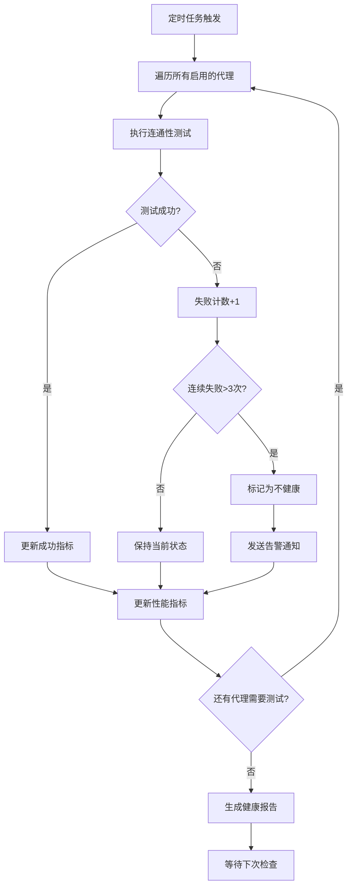
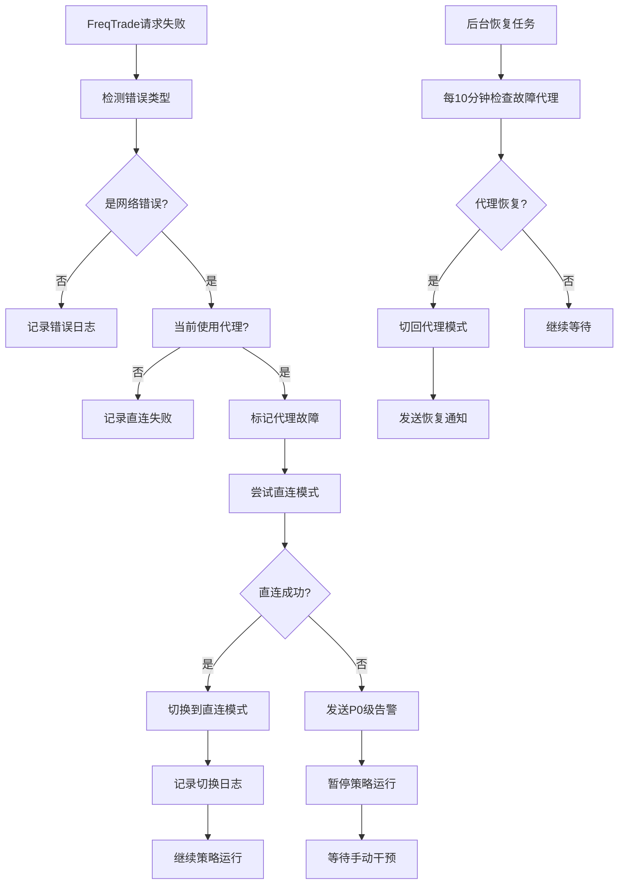
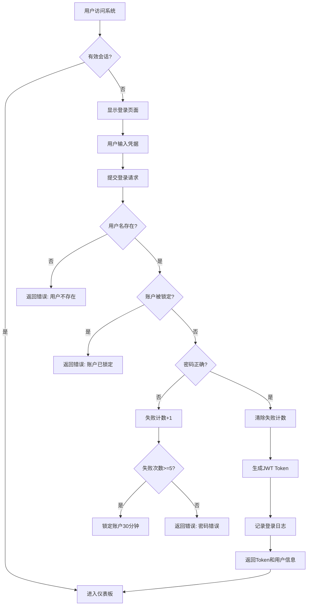
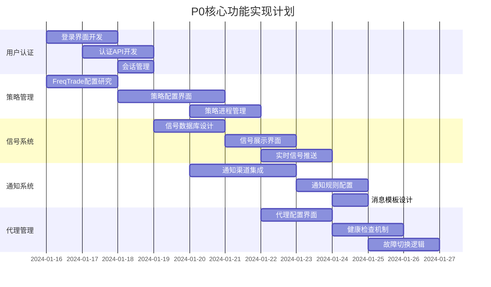
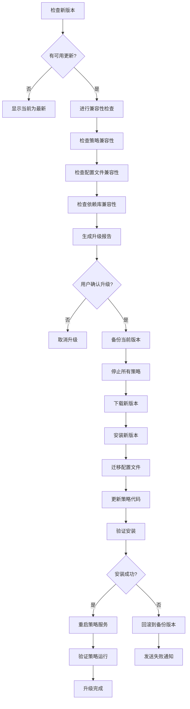

# BTC Watcher 详细设计文档

## 基于业务细节明确的系统设计

---

## 1. 策略分类和管理设计

### 1.1 策略用途分类

基于您的反馈，策略应该按用途分为两大类：

#### 策略类型1：信号监控策略（当前重点）
**用途**：仅输出交易信号，不执行实际交易
**特点**：
- 不需要资金管理参数
- 不需要止损/止盈设置
- 不需要仓位管理
- FreqTrade运行在Dry-run模式

**核心配置参数**：
- 策略名称和描述
- 策略代码文件路径（指向已编写好的.py文件）
- 监控的交易对列表
- 主时间周期 (timeframe)
- 网络代理设置
- 信号输出配置
- 通知规则

#### 策略类型2：交易执行策略（未来扩展）
**用途**：实际执行交易
**特点**：
- 需要完整的风险控制参数
- 需要资金管理配置
- 需要止损/止盈/尾随止损
- FreqTrade运行在Live模式

**额外配置参数**：
- 最大持仓数量
- 每笔交易金额
- 止损百分比
- 止盈百分比
- 资金管理策略

### 1.2 策略模板设计（重新设计）

**模板1：信号监控策略模板**
```yaml
模板类型: 信号监控
预设参数:
  - dry_run: true
  - stake_amount: 0 (不实际交易)
  - 信号输出: enabled
  - 通知: enabled
需要配置:
  - 策略代码文件
  - 交易对列表
  - 主时间周期
  - 代理设置
```

**模板2：交易执行策略模板（预留）**
```yaml
模板类型: 交易执行
预设参数:
  - dry_run: false
  - 风险控制: enabled
  - 资金管理: enabled
需要配置:
  - 所有信号监控参数
  - 资金管理参数
  - 风险控制参数
  - 交易所API配置
```

---

## 2. FreqTrade配置管理详细设计

### 2.1 策略配置文件结构

基于FreqTrade的实际配置文件格式：

```json
{
  "strategy": "策略类名",
  "strategy_path": "user_data/strategies/",
  "timeframe": "5m",
  "tradable_balance_ratio": 0,
  "dry_run": true,
  "dry_run_wallet": 0,

  "exchange": {
    "name": "binance",
    "key": "",
    "secret": "",
    "ccxt_config": {
      "enableRateLimit": true
    },
    "ccxt_async_config": {
      "enableRateLimit": true
    },
    "pair_whitelist": [
      "BTC/USDT",
      "ETH/USDT",
      "ADA/USDT",
      "SOL/USDT"
    ],
    "pair_blacklist": []
  },

  "pairlists": [
    {
      "method": "StaticPairList"
    }
  ],

  "telegram": {
    "enabled": false
  },

  "api_server": {
    "enabled": false
  },

  "initial_state": "running",

  "internals": {
    "process_throttle_secs": 5
  }
}
```

### 2.2 图形化配置界面设计

```
┌─────────────────────────────────────────────────────────────┐
│                  创建/编辑信号监控策略                        │
├─────────────────────────────────────────────────────────────┤
│ ┌─基础信息─────────────────────────────────────────────────┐ │
│ │策略名称: [MA_Cross_BTC_Monitor___________________]       │ │
│ │描述说明: [双均线交叉监控策略_______________________]     │ │
│ │                                                         │ │
│ │策略类型: ● 信号监控策略  ○ 交易执行策略（未来）          │ │
│ │                                                         │ │
│ │草稿管理: [另存为草稿] [从草稿加载▼] [草稿列表]          │ │
│ │          当前状态: ○ 已保存  ● 草稿  ○ 新建            │ │
│ └─────────────────────────────────────────────────────────┘ │
├─────────────────────────────────────────────────────────────┤
│ ┌─策略代码─────────────────────────────────────────────────┐ │
│ │策略文件: [选择文件]                                       │ │
│ │          当前: user_data/strategies/ma_cross.py         │ │
│ │                                                         │ │
│ │策略类名: [MACrossStrategy_____________]                  │ │
│ │          (自动从文件读取可用策略类)                       │ │
│ │                                                         │ │
│ │[上传新策略文件] [AI生成策略代码] [从模板创建]             │ │
│ └─────────────────────────────────────────────────────────┘ │
├─────────────────────────────────────────────────────────────┤
│ ┌─FreqTrade核心配置────────────────────────────────────────┐ │
│ │主时间周期 (timeframe):                                    │ │
│ │  [5m ▼]                                                 │ │
│ │  选项: 1m, 3m, 5m, 15m, 30m, 1h, 2h, 4h, 6h, 12h, 1d   │ │
│ │                                                         │ │
│ │监控交易对 (pair_whitelist):                              │ │
│ │  已选择的交易对:                                          │ │
│ │  ☑ BTC/USDT   ☑ ETH/USDT   ☑ ADA/USDT                  │ │
│ │  ☑ SOL/USDT   ☐ DOT/USDT   ☐ MATIC/USDT                │ │
│ │  [+ 添加自定义交易对]  [从列表选择...]                     │ │
│ │                                                         │ │
│ │交易所:                                                   │ │
│ │  [Binance ▼]                                            │ │
│ │  选项: Binance, OKX, Bybit, Bitget                      │ │
│ └─────────────────────────────────────────────────────────┘ │
├─────────────────────────────────────────────────────────────┤
│ ┌─网络代理配置──────────────────────────────────────────────┐ │
│ │代理设置: [使用系统代理 ▼]                                 │ │
│ │          选项: 不使用代理 / 使用系统代理 / 自定义代理      │ │
│ │                                                         │ │
│ │自定义代理配置: (选择"自定义代理"时显示)                    │ │
│ │  类型: [SOCKS5 ▼]                                       │ │
│ │  地址: [proxy.example.com___________]                   │ │
│ │  端口: [1080____]                                       │ │
│ │  用户名: [___________] (可选)                            │ │
│ │  密码: [___________] (可选)                              │ │
│ └─────────────────────────────────────────────────────────┘ │
├─────────────────────────────────────────────────────────────┤
│ ┌─信号输出和通知配置────────────────────────────────────────┐ │
│ │信号输出:                                                 │ │
│ │  ☑ 启用信号输出                                          │ │
│ │  ☑ 输出到数据库                                          │ │
│ │  ☑ 输出到文件 (路径: /app/signals/signals.json)         │ │
│ │                                                         │ │
│ │触发通知:                                                 │ │
│ │  ☑ 买入信号触发通知                                      │ │
│ │  ☑ 卖出信号触发通知                                      │ │
│ │  ☑ 策略错误触发通知                                      │ │
│ │  信号强度阈值配置 (与汇总界面联动):                        │ │
│ └─────────────────────────────────────────────────────────┘ │
├─────────────────────────────────────────────────────────────┤
│ ┌─信号强度阈值配置───────────────────────────────────────────┐ │
│ │策略输出范围: [0____] 到 [100__] （由策略代码定义）       │ │
│ │                                                         │ │
│ │强烈信号阈值: [≥ 80___] → P0立即通知 🔴                 │ │
│ │中等信号阈值: [≥ 50___] → P1通知 🟠                    │ │
│ │弱信号阈值:   [≥ 20___] → P2批量通知 🟡                 │ │
│ │忽略阈值:     [< 20___] → 不发送通知 ⚪                  │ │
│ │                                                         │ │
│ │阈值预览: 0───20───50───80───100          │ │
│ │          ⚪⚪⚪⚪🟡🟡🟡🟠🟠🟠🔴🔴🔴🔴🔴         │ │
│ │                                                         │ │
│ │[预设模板▼] [测试阈值] [从汇总配置同步] [重置默认]     │ │
│ └─────────────────────────────────────────────────────────┘ │
├─────────────────────────────────────────────────────────────┤
│ ┌─高级配置──────────────────────────────────────────────────┐ │
│ │数据更新频率 (process_throttle_secs): [5__] 秒            │ │
│ │                                                         │ │
│ │启动状态: ● 立即运行  ○ 创建后停止                         │ │
│ │                                                         │ │
│ │版本控制:                                                 │ │
│ │  ☑ 保存为新版本 (版本号: v2.2)                           │ │
│ │  版本说明: [___________________________________]         │ │
│ │                                                         │ │
│ │草稿选项:                                                 │ │
│ │  ☑ 自动保存草稿 (每30秒)                                │ │
│ │  草稿保留时间: [7___] 天                                │ │
│ └─────────────────────────────────────────────────────────┘ │
├─────────────────────────────────────────────────────────────┤
│                                                             │
│ [保存策略] [保存草稿] [测试配置] [取消] [查看完整配置JSON]    │
│                                                             │
└─────────────────────────────────────────────────────────────┘
```

### 2.3 策略代码文件管理

**策略文件结构**：
```
user_data/
  strategies/
    ma_cross.py              # 用户上传的策略文件
    rsi_strategy.py
    custom_combo.py
    templates/               # 预设模板
      signal_monitor_base.py # 信号监控基类模板
```

**策略文件上传流程**：
1. 用户通过AI工具编写策略代码
2. 在Web界面上传.py文件
3. 系统自动扫描文件中的策略类
4. 用户选择要使用的策略类
5. 配置其他参数后保存

**AI生成策略功能**（可选，未来扩展）：
- 用户描述策略逻辑
- 调用AI API生成策略代码
- 用户审查和调整代码
- 保存并应用策略

---

## 3. 信号管理详细设计

### 3.1 信号数据结构

```json
{
  "signal_id": "uuid",
  "timestamp": "2024-01-15T14:25:30Z",
  "strategy_id": 123,
  "strategy_name": "MA_Cross_BTC_Monitor",
  "strategy_version": "v2.1",
  "pair": "BTC/USDT",
  "exchange": "binance",
  "timeframe": "5m",
  "signal_type": "BUY",
  "strength": 85.5,
  "strength_raw": 85.5,  // 策略输出的原始强度数值
  "strength_level": "strong", // 根据阈值计算的强度等级
  "priority": "P0",  // 通知优先级
  "price": 42500.00,
  "indicators": {
    "rsi": 68.5,
    "macd": 0.25,
    "macd_signal": 0.15,
    "ma_fast": 42300,
    "ma_slow": 42100
  },
  "metadata": {
    "candle_close_time": "2024-01-15T14:25:00Z",
    "volume_24h": 28500.5,
    "price_change_24h": 2.5
  },
  "notification_sent": true,
  "notification_channels": ["sms", "feishu"],
  "notification_time": "2024-01-15T14:25:31Z"
}
```

### 3.2 信号强度计算（基于策略输出数值）

**设计原则**：
1. **策略输出**：每个策略输出一个强度数值（值域不限制）
2. **UI阈值配置**：在界面上配置高中低三个阈值
3. **强度分级**：根据策略输出值与阈值比较确定等级

**策略强度输出示例**：

**MA交叉策略**：
- 输出值范围: 0-100
- 示例: 当MA金叉+RSI适中+成交量放大时，输出85

**RSI策略**：
- 输出值范围: 0-10
- 示例: RSI超卖程度越深，输出值越高，最高达10

**MACD策略**：
- 输出值范围: -5 到 +5
- 示例: MACD金叉时输出正值，值越大信号越强

**组合策略**：
- 输出值范围: 0-1000
- 示例: 多个指标加权综合计算得分

**阈值配置界面**：
```
┌─信号强度阈值配置───────────────────────────────────────────────┐
│按策略分别设置强度阈值:                                        │
│                                                      │
│MA_Cross_BTC策略 (输出范围: 0-100):                         │
│  强烈信号阈值: [≥ 80___] → P0立即通知                    │
│  中等信号阈值: [≥ 50___] → P1通知                       │
│  弱信号阈值:   [≥ 20___] → P2批量通知                    │
│  忽略阈值:     [< 20___] → 不发送通知                     │
│                                                      │
│RSI_ETH策略 (输出范围: 0-10):                            │
│  强烈信号阈值: [≥ 8____] → P0立即通知                    │
│  中等信号阈值: [≥ 5____] → P1通知                       │
│  弱信号阈值:   [≥ 2____] → P2批量通知                    │
│  忽略阈值:     [< 2____] → 不发送通知                     │
│                                                      │
│MACD_SOL策略 (输出范围: -5 到 +5):                       │
│  强烈信号阈值: [≥ 3____] → P0立即通知                    │
│  中等信号阈值: [≥ 1____] → P1通知                       │
│  弱信号阈值:   [≥ 0.5__] → P2批量通知                    │
│  忽略阈值:     [< 0.5__] → 不发送通知                     │
│                                                      │
│Custom_Combo策略 (输出范围: 0-1000):                      │
│  强烈信号阈值: [≥ 800__] → P0立即通知                    │
│  中等信号阈值: [≥ 500__] → P1通知                       │
│  弱信号阈值:   [≥ 200__] → P2批量通知                    │
│  忽略阈值:     [< 200__] → 不发送通知                     │
│                                                      │
│全局设置:                                             │
│  ☑ 允许策略覆盖全局设置                               │
│  ☑ 相同强度级别使用统一通知频率                        │
│  系统告警: 固定P0级别                                │
│                                                      │
│[批量设置] [预设模板] [测试阈值] [重置默认]                │
└──────────────────────────────────────────────────────┘
```

**强度计算逻辑**：
```python
def calculate_signal_priority(strategy_name, signal_value):
    # 获取策略的阈值配置
    thresholds = get_strategy_thresholds(strategy_name)

    if signal_value >= thresholds.strong:
        return "P0"  # 强烈信号 - 立即通知
    elif signal_value >= thresholds.medium:
        return "P1"  # 中等信号 - 1分钟内通知
    elif signal_value >= thresholds.weak:
        return "P2"  # 弱信号 - 批量通知
    else:
        return "IGNORE"  # 忽略 - 不发送通知
```

**阈值配置联动机制**：
```json
{
  "threshold_sync": {
    "sync_mode": "bidirectional",  // 双向同步
    "sync_events": [
      "strategy_config_save",      // 策略配置保存时
      "threshold_summary_update"   // 汇总界面更新时
    ],
    "conflict_resolution": "last_modified_wins"  // 冲突解决策略
  }
}
```

**联动流程**：
1. **策略配置 → 汇总界面**：保存策略时自动更新汇总界面对应策略的阈值
2. **汇总界面 → 策略配置**：批量修改阈值时实时更新所有打开的策略配置页面
3. **冲突处理**：同时修改时以最后保存的为准，并提示用户刷新页面

### 3.3 信号展示界面（详细）

```
┌─────────────────────────────────────────────────────────────┐
│ 信号监控中心                           [实时刷新: 开●]       │
├─────────────────────────────────────────────────────────────┤
│ 筛选条件: 交易对[全部▼] 策略[全部▼] 强度[强烈▼] 时间[24h▼]   │
├─────────────────────────────────────────────────────────────┤
│ 最新信号 (实时更新)                                          │
│ ┌───────┬─────────┬──────┬──────┬───────┬──────┬─────────┐  │
│ │时间   │交易对   │信号  │强度  │价格   │策略  │通知状态  │  │
│ ├───────┼─────────┼──────┼──────┼───────┼──────┼─────────┤  │
│ │14:25  │BTC/USDT │🟢买入│85.5  │42,500 │MA_v2 │✓已发送  │  │
│ │       │         │      │(强烈) │       │      │短信+飞书 │  │
│ ├───────┼─────────┼──────┼──────┼───────┼──────┼─────────┤  │
│ │14:22  │ETH/USDT │🔴卖出│6.8   │2,250  │RSI_v1│✓已发送  │  │
│ │       │         │      │(中等) │       │      │短信      │  │
│ ├───────┼─────────┼──────┼──────┼───────┼──────┼─────────┤  │
│ │14:18  │ADA/USDT │🟡持有│--    │0.85   │Combo │--       │  │
│ ├───────┼─────────┼──────┼──────┼───────┼──────┼─────────┤  │
│ │14:15  │SOL/USDT │🟢买入│2.8   │95.50  │MACD  │✓已发送  │  │
│ │       │         │      │(强烈) │       │      │全部渠道  │  │
│ └───────┴─────────┴──────┴──────┴───────┴──────┴─────────┘  │
│                                                             │
│ 显示第1-20条，共156条信号 | [首页] [上页] 1 2 3 ... 8 [下页] [末页] │
│ 每页显示: [20▼]条 | [导出当前页] [导出全部]                    │
│                                                             │
│ 点击信号查看详情 → 显示技术指标、K线图、历史表现            │
└─────────────────────────────────────────────────────────────┘
```

### 3.4 信号详情弹窗

```
┌─────────────────────────────────────────────────────────────┐
│ 信号详情                                            [关闭 X] │
├─────────────────────────────────────────────────────────────┤
│ ┌─基础信息─────────────┬─技术指标─────────────────────────┐ │
│ │交易对: BTC/USDT      │RSI (14):        68.5            │ │
│ │信号类型: 买入 🟢     │MACD:            +0.25           │ │
│ │策略强度: 85.5 (强烈) │MACD Signal:     +0.15           │ │
│ │阈值设置: ≥80强烈     │MA Fast (10):    42,300          │ │
│ │触发时间: 14:25:30    │MA Slow (20):    42,100          │ │
│ │当前价格: $42,500     │Volume 24h:      28.5K BTC       │ │
│ │策略: MA_Cross_v2.1   │Price Chg 24h:   +2.5%           │ │
│ │交易所: Binance       │通知优先级: P0 (立即发送)         │ │
│ └─────────────────────┴─────────────────────────────────┘ │
├─────────────────────────────────────────────────────────────┤
│ ┌─信号触发逻辑─────────────────────────────────────────────┐ │
│ │✓ MA快线上穿慢线 (金叉)                                   │ │
│ │✓ RSI处于中性区间 (50-70)                                 │ │
│ │✓ MACD柱状图由负转正                                      │ │
│ │✓ 成交量放大 (高于MA20)                                   │ │
│ └─────────────────────────────────────────────────────────┘ │
├─────────────────────────────────────────────────────────────┤
│ ┌─K线图快照────────────────────────────────────────────────┐ │
│ │  [此处显示触发信号时刻的K线图和技术指标]                  │ │
│ └─────────────────────────────────────────────────────────┘ │
├─────────────────────────────────────────────────────────────┤
│ ┌─通知状态─────────────────────────────────────────────────┐ │
│ │✓ 短信     发送成功  14:25:31                             │ │
│ │✓ 飞书     发送成功  14:25:32                             │ │
│ │✓ 微信     发送成功  14:25:33                             │ │
│ └─────────────────────────────────────────────────────────┘ │
│                                                             │
│ [查看完整图表] [导出信号数据] [标记为重要] [关闭]            │
└─────────────────────────────────────────────────────────────┘
```

---

## 4. 通知系统详细设计

### 4.1 通知消息模板（修订）

**交易信号通知（精简版）**：
```
🔔 BTC/USDT 买入信号
强度: 85% ████▌
价格: $42,500
策略: MA_Cross_v2.1
时间: 14:25:30
---
RSI: 68.5 | MACD: +0.25
MA金叉确认 + MACD转正
```

**交易信号通知（详细版，可配置）**：
```
🔔 交易信号
━━━━━━━━━━━━━━━━━━━━
交易对: BTC/USDT (Binance)
信号类型: 买入 🟢
信号强度: 85% ████▌
当前价格: $42,500
━━━━━━━━━━━━━━━━━━━━
策略信息:
  名称: MA_Cross_v2.1
  时间周期: 5分钟
  触发时间: 14:25:30
━━━━━━━━━━━━━━━━━━━━
技术指标:
  RSI(14): 68.5
  MACD: +0.25 (信号线: +0.15)
  MA快线: 42,300
  MA慢线: 42,100
━━━━━━━━━━━━━━━━━━━━
触发条件:
  ✓ MA快线上穿慢线
  ✓ MACD柱状图转正
  ✓ RSI中性区间
  ✓ 成交量放大
━━━━━━━━━━━━━━━━━━━━
[查看图表] https://btc-watcher.local/chart?pair=BTCUSDT&time=1642252530
```

**系统告警通知**：
```
⚠️ 系统告警
━━━━━━━━━━━━━━━━━━━━
告警类型: 策略进程异常
策略名称: MA_Cross_v2.1
━━━━━━━━━━━━━━━━━━━━
详细信息:
  FreqTrade进程意外停止
  最后更新: 14:20:30
  运行时长: 2小时15分
━━━━━━━━━━━━━━━━━━━━
建议操作:
  1. 检查策略日志
  2. 查看系统资源
  3. 重启策略进程
━━━━━━━━━━━━━━━━━━━━
[查看详情] [重启策略] [暂时忽略]
```

### 4.2 通知频率控制（详细规则）

**规则1：同交易对同方向限制**
- 相同交易对 + 相同信号类型（买入/卖出）
- 5分钟内最多发送1次
- 例外：强度提升>20%时可再次发送

**规则2：全局频率限制**
- 所有信号通知：每分钟最多5条
- 超出限制的信号：
  - 批量汇总，每5分钟发送一次汇总
  - 或降级存储到数据库，不发送通知

**规则3：优先级队列（基于策略自定义强度）**
- P0（立即）：系统故障、策略定义的强烈信号
- P1（1分钟内）：策略定义的中等信号、策略状态变化
- P2（5分钟批量）：策略定义的弱信号、定期报告

**规则3.1：强度阈值个性化配置**
```
┌─通知强度阈值配置────────────────────────────────────────┐
│按策略分别设置:                                        │
│                                                      │
│MA_Cross_BTC策略:                                     │
│  强烈信号触发条件: [已自定义] → P0立即通知             │
│  中等信号触发条件: [已自定义] → P1通知                │
│  弱信号触发条件:   [已自定义] → P2批量通知             │
│                                                      │
│RSI_ETH策略:                                          │
│  强烈信号触发条件: [已自定义] → P0立即通知             │
│  中等信号触发条件: [已自定义] → P1通知                │
│  弱信号触发条件:   [已自定义] → P2批量通知             │
│                                                      │
│全局策略:                                             │
│  ☑ 允许策略覆盖全局设置                               │
│  ☑ 相同强度信号使用统一通知频率                        │
│  系统告警: 固定P0级别                                │
│                                                      │
│[应用到所有策略] [单独配置] [重置为默认]                │
└────────────────────────────────────────────────────┘
```

**规则4：时间段控制**
```json
{
  "work_hours": {
    "time_range": "09:00-18:00",
    "levels": ["P0", "P1", "P2"],
    "channels": ["sms", "feishu", "wechat", "email"]
  },
  "rest_hours": {
    "time_range": "18:00-09:00",
    "levels": ["P0"],
    "channels": ["sms"]
  }
}
```

### 4.3 通知渠道配置管理

```
┌─────────────────────────────────────────────────────────────┐
│ 通知渠道配置                                                 │
├─────────────────────────────────────────────────────────────┤
│ ┌─渠道优先级排序───────────────────────────────────────────┐ │
│ │ 1. 手机短信  [启用●] [配置] [测试]   [↑] [↓]            │ │
│ │    API类型: [阿里云短信 ▼]                               │ │
│ │    AccessKey: [********************]                    │ │
│ │    签名: [BTC监控]  模板: [SMS_123456]                   │ │
│ │                                                         │ │
│ │ 2. 飞书      [启用●] [配置] [测试]   [↑] [↓]            │ │
│ │    Webhook URL: [https://open.feishu.cn/...]           │ │
│ │    签名密钥: [********************]                      │ │
│ │                                                         │ │
│ │ 3. 微信      [启用●] [配置] [测试]   [↑] [↓]            │ │
│ │    类型: [企业微信 ▼]                                    │ │
│ │    Corp ID: [wwxxxxxxxxx]                              │ │
│ │    Agent ID: [1000002]                                 │ │
│ │    Secret: [********************]                       │ │
│ │                                                         │ │
│ │ 4. 邮件      [启用●] [配置] [测试]   [↑] [↓]            │ │
│ │    SMTP服务器: [smtp.gmail.com]  端口: [587]           │ │
│ │    用户名: [user@gmail.com]                            │ │
│ │    密码: [********************]                         │ │
│ │    收件人: [notify@example.com]                         │ │
│ │                                                         │ │
│ │ 5. Telegram  [禁用○] [配置] [测试]   [↑] [↓]            │ │
│ └─────────────────────────────────────────────────────────┘ │
├─────────────────────────────────────────────────────────────┤
│ ┌─通知规则配置─────────────────────────────────────────────┐ │
│ │时间段配置:                                               │ │
│ │                                                         │ │
│ │ 工作时间 (09:00-18:00):                                  │ │
│ │   接收级别: ☑P0紧急 ☑P1重要 ☑P2一般                     │ │
│ │   使用渠道: ☑短信 ☑飞书 ☑微信 ☑邮件                     │ │
│ │                                                         │ │
│ │ 休息时间 (18:00-09:00):                                  │ │
│ │   接收级别: ☑P0紧急 ☐P1重要 ☐P2一般                     │ │
│ │   使用渠道: ☑短信 ☐飞书 ☐微信 ☐邮件                     │ │
│ │                                                         │ │
│ │频率限制:                                                 │ │
│ │   同币种同向信号间隔: [5___] 分钟                        │ │
│ │   全局信号上限: 每分钟 [5___] 条                         │ │
│ │   批量汇总间隔: [5___] 分钟                              │ │
│ │                                                         │ │
│ │消息模板:                                                 │ │
│ │   ● 精简版  ○ 详细版  ○ 自定义                          │ │
│ │   ☑ 包含技术指标                                         │ │
│ │   ☑ 包含图表链接                                         │ │
│ │   ☐ 包含图表截图 (仅邮件/飞书)                           │ │
│ └─────────────────────────────────────────────────────────┘ │
│                                                             │
│ [保存配置] [重置默认] [导出配置] [导入配置]                  │
└─────────────────────────────────────────────────────────────┘
```

---

## 5. 代理管理详细设计

### 5.1 代理配置数据结构

```json
{
  "proxy_id": 1,
  "name": "主代理SOCKS5",
  "type": "socks5",
  "host": "proxy.example.com",
  "port": 1080,
  "username": "proxyuser",
  "password": "encrypted_password",
  "enabled": true,
  "priority": 1,
  "test_url": "https://api.binance.com/api/v3/ping",
  "health_check": {
    "interval_seconds": 3600,
    "timeout_seconds": 10,
    "retry_count": 3
  },
  "performance_metrics": {
    "success_rate": 95.2,
    "avg_latency_ms": 156,
    "last_success_time": "2024-01-15T14:25:30Z",
    "last_failure_time": "2024-01-15T12:30:00Z",
    "total_requests": 1523,
    "failed_requests": 73
  },
  "status": "healthy",
  "created_at": "2024-01-01T00:00:00Z",
  "updated_at": "2024-01-15T14:25:30Z"
}
```

### 5.2 代理健康检查流程



### 5.3 代理故障切换详细流程



---

## 6. 策略状态监控详细设计

### 6.1 策略健康指标采集

```python
# 策略健康状态数据结构
{
  "strategy_id": 123,
  "strategy_name": "MA_Cross_BTC_Monitor",
  "status": "running",  # running/warning/error/stopped
  "health_score": 92,   # 0-100分综合健康分数

  "process_metrics": {
    "pid": 12345,
    "uptime_seconds": 7920,
    "cpu_percent": 2.5,
    "memory_mb": 156.8,
    "thread_count": 8
  },

  "data_metrics": {
    "last_data_update": "2024-01-15T14:25:28Z",
    "data_delay_seconds": 2,
    "data_update_rate": 0.2,  # 每秒更新次数
    "missing_data_count": 0
  },

  "signal_metrics": {
    "total_signals_24h": 15,
    "buy_signals_24h": 8,
    "sell_signals_24h": 7,
    "last_signal_time": "2024-01-15T14:25:30Z",
    "avg_signal_strength": 78.5
  },

  "error_metrics": {
    "error_count_1h": 0,
    "error_count_24h": 2,
    "last_error_time": "2024-01-15T10:30:00Z",
    "last_error_message": "Rate limit exceeded"
  },

  "performance_metrics": {
    "avg_processing_time_ms": 85,
    "max_processing_time_ms": 350,
    "request_success_rate": 98.5
  }
}
```

### 6.2 健康分数计算算法

```python
def calculate_health_score(metrics):
    score = 100

    # 进程状态 (30分)
    if not metrics.process_metrics.pid:
        score -= 30
    elif metrics.process_metrics.memory_mb > 500:
        score -= 10
    elif metrics.process_metrics.cpu_percent > 80:
        score -= 5

    # 数据更新 (30分)
    data_delay = metrics.data_metrics.data_delay_seconds
    if data_delay > 60:
        score -= 30
    elif data_delay > 30:
        score -= 15
    elif data_delay > 10:
        score -= 5

    # 信号产生 (20分)
    hours_since_signal = (now() - metrics.signal_metrics.last_signal_time).hours
    if hours_since_signal > 24:
        score -= 20
    elif hours_since_signal > 12:
        score -= 10

    # 错误频率 (20分)
    if metrics.error_metrics.error_count_1h > 10:
        score -= 20
    elif metrics.error_metrics.error_count_1h > 5:
        score -= 10
    elif metrics.error_metrics.error_count_24h > 50:
        score -= 5

    return max(0, score)
```

### 6.3 策略状态展示（增强版）

```
┌─────────────────────────────────────────────────────────────┐
│ 策略监控中心                           [显示草稿: ☑] [创建新策略] │
├─────────────────────────────────────────────────────────────┤
│ 总览: 5个策略 | 4个运行中 | 1个错误 | 3个草稿 | 系统负载: 正常      │
├─────────────────────────────────────────────────────────────┤
│ ┌──────────────┬───────┬────────┬──────┬──────┬──────────┐  │
│ │策略名称      │状态   │健康分数│运行  │信号  │操作       │  │
│ │              │       │        │时长  │(24h) │          │  │
│ ├──────────────┼───────┼────────┼──────┼──────┼──────────┤  │
│ │MA_Cross_BTC  │运行中●│92分   │2h15m │15    │[详情]    │  │
│ │v2.1          │       │█████  │      │      │[停止]    │  │
│ │              │       │        │      │      │[日志]    │  │
│ ├──────────────┼───────┼────────┼──────┼──────┼──────────┤  │
│ │RSI_ETH       │运行中●│88分   │1h45m │8     │[详情]    │  │
│ │v1.3          │       │████▌  │      │      │[停止]    │  │
│ ├──────────────┼───────┼────────┼──────┼──────┼──────────┤  │
│ │Custom_SOL    │运行中●│95分   │3h02m │22    │[详情]    │  │
│ │v1.0          │       │█████  │      │      │[停止]    │  │
│ ├──────────────┼───────┼────────┼──────┼──────┼──────────┤  │
│ │Bollinger_ADA │错误❌ │15分   │--    │0     │[详情]    │  │
│ │v1.2          │       │█     │      │      │[重启]    │  │
│ │              │       │进程异常│      │      │[删除]    │  │
│ ├──────────────┼───────┼────────┼──────┼──────┼──────────┤  │
│ │MACD_DOT      │停止○ │--    │--    │--    │[详情]    │  │
│ │v2.0          │       │        │      │      │[启动]    │  │
│ ├──────────────┼───────┼────────┼──────┼──────┼──────────┤  │
│ │[草稿] EMA_BTC │草稿📝 │--    │--    │--    │[编辑]    │  │
│ │v0.1-draft    │       │未保存  │      │      │[发布]    │  │
│ │              │       │修改中  │      │      │[删除]    │  │
│ ├──────────────┼───────┼────────┼──────┼──────┼──────────┤  │
│ │[草稿] RSI_ADA │草稿📝 │--    │--    │--    │[编辑]    │  │
│ │v0.1-draft    │       │保存中  │      │      │[发布]    │  │
│ │              │       │3分钟前  │      │      │[删除]    │  │
│ ├──────────────┼───────┼────────┼──────┼──────┼──────────┤  │
│ │[草稿] BB_SOL  │草稿📝 │--    │--    │--    │[编辑]    │  │
│ │v0.1-draft    │       │过期了  │      │      │[彻底删除] │  │
│ │              │       │7天前   │      │      │          │  │
│ └──────────────┴───────┴────────┴──────┴──────┴──────────┘  │
│                                                             │
│ 显示第1-10条，共25个策略 | [首页] [上页] 1 2 3 [下页] [末页]      │
│ 每页显示: [10▼]条 | [批量操作] [草稿管理] [导出报告] [系统诊断]   │
│ [清理过期草稿] [全部发布] [全部删除草稿]                       │
└─────────────────────────────────────────────────────────────┘
```

### 6.4 草稿管理功能设计

**草稿保存策略**：
```json
{
  "draft_id": "uuid",
  "strategy_name": "EMA_BTC_Strategy",
  "version": "v0.1-draft",
  "status": "draft",
  "auto_save": true,
  "created_at": "2024-01-15T14:25:30Z",
  "last_modified": "2024-01-15T14:28:45Z",
  "expires_at": "2024-01-22T14:25:30Z",  // 7天后过期
  "config_data": {
    "strategy_type": "signal_monitor",
    "timeframe": "5m",
    "pair_whitelist": ["BTC/USDT"],
    "exchange": "binance",
    "proxy_settings": {...},
    "signal_config": {...}
  },
  "save_source": "auto",  // auto, manual, exit
  "change_summary": "修改了时间周期和交易对"
}
```

**草稿管理界面**：
```
┌─────────────────────────────────────────────────────────────┐
│ 草稿管理中心                                                 │
├─────────────────────────────────────────────────────────────┤
│ 总计: 3个草稿 | 1个修改中 | 1个保存中 | 1个过期                   │
├─────────────────────────────────────────────────────────────┤
│ ┌─────────────────┬─────────┬──────────┬───────────────┐  │
│ │草稿名称        │状态     │最后修改    │操作           │  │
│ ├─────────────────┼─────────┼──────────┼───────────────┤  │
│ │EMA_BTC_Strategy │修改中📝 │3分钟前    │[继续编辑]   │  │
│ │v0.1-draft       │         │          │[发布策略]   │  │
│ │                 │         │          │[删除草稿]   │  │
│ ├─────────────────┼─────────┼──────────┼───────────────┤  │
│ │RSI_ADA_Strategy │保存中💾 │5分钟前    │[继续编辑]   │  │
│ │v0.1-draft       │自动保存 │          │[发布策略]   │  │
│ │                 │         │          │[删除草稿]   │  │
│ ├─────────────────┼─────────┼──────────┼───────────────┤  │
│ │BB_SOL_Strategy  │过期❌    │7天前     │[查看配置]   │  │
│ │v0.1-draft       │不可编辑 │即将删除  │[彻底删除]   │  │
│ │                 │         │          │[复制为新策略] │  │
│ └─────────────────┴─────────┴──────────┴───────────────┘  │
│                                                             │
│ 显示第1-10条，共15个草稿 | [首页] [上页] 1 2 [下页] [末页]        │
│ 每页显示: [10▼]条 | [全部发布] [清理过期] [全部删除] [草稿设置]   │
└─────────────────────────────────────────────────────────────┘
```

**草稿设置参数**：
```
┌─草稿管理设置──────────────────────────────────────────────────────────────────┐
│自动保存草稿: ☑ 启用                                        │
│  保存间隔: [30__] 秒                                        │
│  保存触发: ☑ 表单内容变化  ☑ 页面离开  ☑ 定时保存          │
│                                                      │
│草稿保留策略: [7___] 天                                      │
│  过期处理: ● 自动删除  ○ 保留但禁止编辑                     │
│                                                      │
│版本号命名规则: [v0.{counter}-draft]                         │
│  示例: v0.1-draft, v0.2-draft, v0.3-draft                │
│                                                      │
│发布时版本升级: ● 自动升级到v1.0  ○ 手动指定版本号          │
│                                                      │
│[保存设置] [重置默认] [清理所有过期草稿]                     │
└──────────────────────────────────────────────────────────────────────────────┘
```

### 6.5 策略详情页面

```
┌─────────────────────────────────────────────────────────────┐
│ 策略详情: MA_Cross_BTC_Monitor v2.1              [返回列表] │
├─────────────────────────────────────────────────────────────┤
│ ┌─基础信息─────────────┬─运行状态─────────────────────────┐ │
│ │策略ID: 123           │状态: 运行中 ●                    │ │
│ │策略类型: 信号监控     │健康分数: 92/100 █████           │ │
│ │创建时间: 2024-01-10   │运行时长: 2小时15分               │ │
│ │最后修改: 2024-01-15   │启动时间: 12:10:15               │ │
│ │版本: v2.1            │PID: 12345                       │ │
│ └─────────────────────┴─────────────────────────────────┘ │
├─────────────────────────────────────────────────────────────┤
│ ┌─配置信息─────────────────────────────────────────────────┐ │
│ │策略文件: user_data/strategies/ma_cross.py               │ │
│ │策略类: MACrossStrategy                                  │ │
│ │时间周期: 5分钟                                           │ │
│ │交易对: BTC/USDT, ETH/USDT, ADA/USDT                     │ │
│ │交易所: Binance                                          │ │
│ │代理: 使用系统代理 (SOCKS5)                               │ │
│ │                                                         │ │
│ │[编辑配置] [查看完整配置] [复制为新策略]                   │ │
│ └─────────────────────────────────────────────────────────┘ │
├─────────────────────────────────────────────────────────────┤
│ ┌─性能指标─────────────────────────────────────────────────┐ │
│ │CPU使用: 2.5% ▂▃▂▄▃▂▅                                   │ │
│ │内存使用: 156.8 MB                                        │ │
│ │数据延迟: 2秒                                             │ │
│ │请求成功率: 98.5% ████▌                                  │ │
│ │平均处理时间: 85ms                                        │ │
│ └─────────────────────────────────────────────────────────┘ │
├─────────────────────────────────────────────────────────────┤
│ ┌─信号统计(24小时)─────────────────────────────────────────┐ │
│ │总信号数: 15                                              │ │
│ │  买入: 8  █████████                                     │ │
│ │  卖出: 7  ████████                                      │ │
│ │                                                         │ │
│ │平均强度: 78.5%                                           │ │
│ │最强信号: 91% (SOL/USDT买入)                             │ │
│ │最近信号: 2分钟前 (BTC/USDT买入 85%)                      │ │
│ │                                                         │ │
│ │[查看所有信号] [信号统计报告]                             │ │
│ └─────────────────────────────────────────────────────────┘ │
├─────────────────────────────────────────────────────────────┤
│ ┌─错误日志(最近)───────────────────────────────────────────┐ │
│ │14:20:30 [WARNING] Rate limit approaching (80%)          │ │
│ │13:45:12 [INFO] Reconnected to exchange after timeout   │ │
│ │12:30:00 [ERROR] Connection timeout, retrying...        │ │
│ │                                                         │ │
│ │[查看完整日志] [下载日志] [清除日志]                       │ │
│ └─────────────────────────────────────────────────────────┘ │
│                                                             │
│ [重启策略] [停止策略] [编辑策略] [删除策略] [导出数据]        │
└─────────────────────────────────────────────────────────────┘
```

---

## 7. 多语言支持实现设计

### 7.1 语言资源文件结构

```
locales/
  zh-CN/
    common.json         # 通用术语
    auth.json          # 登录认证
    dashboard.json     # 仪表板
    strategy.json      # 策略管理
    signal.json        # 信号管理
    notification.json  # 通知系统
    proxy.json         # 代理管理
    errors.json        # 错误消息
  en-US/
    common.json
    auth.json
    ...
```

### 7.2 语言文件示例

```json
// zh-CN/strategy.json
{
  "strategy": {
    "title": "策略管理",
    "create": "创建策略",
    "edit": "编辑策略",
    "delete": "删除策略",
    "start": "启动策略",
    "stop": "停止策略",

    "type": {
      "signal_monitor": "信号监控策略",
      "trade_execution": "交易执行策略"
    },

    "status": {
      "running": "运行中",
      "stopped": "已停止",
      "error": "错误",
      "warning": "警告"
    },

    "config": {
      "name": "策略名称",
      "description": "描述说明",
      "timeframe": "时间周期",
      "pairs": "交易对",
      "exchange": "交易所",
      "proxy": "代理设置"
    }
  }
}

// en-US/strategy.json
{
  "strategy": {
    "title": "Strategy Management",
    "create": "Create Strategy",
    "edit": "Edit Strategy",
    "delete": "Delete Strategy",
    "start": "Start Strategy",
    "stop": "Stop Strategy",

    "type": {
      "signal_monitor": "Signal Monitor Strategy",
      "trade_execution": "Trade Execution Strategy"
    },

    "status": {
      "running": "Running",
      "stopped": "Stopped",
      "error": "Error",
      "warning": "Warning"
    },

    "config": {
      "name": "Strategy Name",
      "description": "Description",
      "timeframe": "Timeframe",
      "pairs": "Trading Pairs",
      "exchange": "Exchange",
      "proxy": "Proxy Settings"
    }
  }
}
```

### 7.3 前端国际化使用

```vue
<template>
  <div>
    <h1>{{ $t('strategy.title') }}</h1>
    <button>{{ $t('strategy.create') }}</button>

    <select v-model="strategy.status">
      <option value="running">{{ $t('strategy.status.running') }}</option>
      <option value="stopped">{{ $t('strategy.status.stopped') }}</option>
    </select>
  </div>
</template>

<script setup>
import { useI18n } from 'vue-i18n'
const { t, locale } = useI18n()

// 切换语言
const switchLanguage = (lang) => {
  locale.value = lang // 'zh-CN' or 'en-US'
}
</script>
```

---

## 8. 用户认证详细设计

### 8.1 用户数据结构

```json
{
  "user_id": 1,
  "username": "admin",
  "password_hash": "bcrypt_hashed_password",
  "email": "admin@example.com",
  "language": "zh-CN",
  "timezone": "Asia/Shanghai",
  "preferences": {
    "notification_channels": ["sms", "feishu"],
    "dashboard_layout": "default",
    "theme": "light"
  },
  "security": {
    "failed_login_count": 0,
    "last_failed_login": null,
    "locked_until": null,
    "last_login_ip": "192.168.1.100",
    "last_login_time": "2024-01-15T14:25:30Z"
  },
  "created_at": "2024-01-01T00:00:00Z",
  "updated_at": "2024-01-15T14:25:30Z"
}
```

### 8.2 登录流程



### 8.3 登录页面(详细设计)

```html
<!DOCTYPE html>
<html>
<head>
  <title>Login</title>
  <style>
    body {
      margin: 0;
      padding: 0;
      height: 100vh;
      display: flex;
      justify-items: center;
      align-items: center;
      background: linear-gradient(135deg, #667eea 0%, #764ba2 100%);
      font-family: 'Arial', sans-serif;
    }

    .login-container {
      width: 360px;
      margin: 0 auto;
      background: white;
      padding: 40px;
      border-radius: 10px;
      box-shadow: 0 10px 40px rgba(0,0,0,0.2);
    }

    .login-form {
      display: flex;
      flex-direction: column;
      gap: 20px;
    }

    .form-group {
      display: flex;
      flex-direction: column;
      gap: 8px;
    }

    .form-group input {
      padding: 12px;
      border: 1px solid #ddd;
      border-radius: 5px;
      font-size: 14px;
    }

    .form-group input:focus {
      outline: none;
      border-color: #667eea;
    }

    .login-button {
      padding: 12px;
      background: #667eea;
      color: white;
      border: none;
      border-radius: 5px;
      font-size: 16px;
      cursor: pointer;
      transition: background 0.3s;
    }

    .login-button:hover {
      background: #5568d3;
    }

    .language-selector {
      text-align: center;
      margin-top: 20px;
    }

    .language-selector select {
      padding: 8px;
      border: 1px solid #ddd;
      border-radius: 5px;
      font-size: 14px;
    }

    .error-message {
      color: #e74c3c;
      font-size: 14px;
      text-align: center;
    }
  </style>
</head>
<body>
  <div class="login-container">
    <form class="login-form" onsubmit="handleLogin(event)">
      <div class="form-group">
        <input
          type="text"
          id="username"
          placeholder="Username"
          required
          autocomplete="username"
        />
      </div>

      <div class="form-group">
        <input
          type="password"
          id="password"
          placeholder="Password"
          required
          autocomplete="current-password"
        />
      </div>

      <div id="error-message" class="error-message"></div>

      <button type="submit" class="login-button">
        Login
      </button>

      <div class="language-selector">
        <select id="language" onchange="changeLanguage(this.value)">
          <option value="zh-CN">中文</option>
          <option value="en-US">English</option>
        </select>
      </div>
    </form>
  </div>

  <script>
    async function handleLogin(event) {
      event.preventDefault()
      const username = document.getElementById('username').value
      const password = document.getElementById('password').value
      const errorEl = document.getElementById('error-message')

      try {
        const response = await fetch('/api/v1/auth/login', {
          method: 'POST',
          headers: { 'Content-Type': 'application/json' },
          body: JSON.stringify({ username, password })
        })

        const data = await response.json()

        if (response.ok) {
          localStorage.setItem('token', data.token)
          localStorage.setItem('user', JSON.stringify(data.user))
          window.location.href = '/dashboard'
        } else {
          errorEl.textContent = data.message || 'Login failed'
        }
      } catch (error) {
        errorEl.textContent = 'Network error, please try again'
      }
    }

    function changeLanguage(lang) {
      localStorage.setItem('language', lang)
      // 更新页面语言
      updatePageLanguage(lang)
    }

    // 页面加载时恢复语言设置
    window.onload = function() {
      const savedLang = localStorage.getItem('language') || 'zh-CN'
      document.getElementById('language').value = savedLang
      updatePageLanguage(savedLang)
    }

    function updatePageLanguage(lang) {
      const translations = {
        'zh-CN': {
          username: '用户名',
          password: '密码',
          login: '登录'
        },
        'en-US': {
          username: 'Username',
          password: 'Password',
          login: 'Login'
        }
      }

      const t = translations[lang]
      document.getElementById('username').placeholder = t.username
      document.getElementById('password').placeholder = t.password
      document.querySelector('.login-button').textContent = t.login
    }
  </script>
</body>
</html>
```

---

## 9. 系统集成流程总览

### 9.1 第一阶段(P0)实现流程



---

## 10. 通用分页组件设计

### 10.1 分页组件规范

**分页信息显示**：
```
显示第{start}-{end}条，共{total}条{item_type} | [首页] [上页] {page_numbers} [下页] [末页]
每页显示: [{page_size}▼]条 | {action_buttons}
```

**分页组件配置**：
```json
{
  "pagination": {
    "page_size_options": [10, 20, 50, 100],
    "default_page_size": 20,
    "max_visible_pages": 7,  // 显示页码数量
    "show_page_info": true,
    "show_page_size_selector": true,
    "show_total_count": true,
    "items": {
      "signals": "条信号",
      "strategies": "个策略",
      "drafts": "个草稿",
      "notifications": "条通知"
    }
  }
}
```

**响应式分页设计**：
- **桌面端**：完整分页信息 + 页码导航
- **平板端**：简化页码显示（只显示3-5个页码）
- **手机端**：仅显示 上页/下页 + 当前页信息

### 10.2 各列表页面分页配置

**信号列表分页**：
- 默认每页：20条
- 可选每页：10, 20, 50, 100条
- 支持快速跳转到最新信号（第1页）

**策略列表分页**：
- 默认每页：10个
- 可选每页：5, 10, 20条
- 草稿和正式策略分别计数

**通知历史分页**：
- 默认每页：20条
- 可选每页：10, 20, 50, 100条
- 支持按时间范围筛选

**草稿管理分页**：
- 默认每页：10个
- 可选每页：5, 10, 20条
- 按修改时间排序

## 11. FreqTrade版本管理设计

### 11.1 版本管理原则

**统一版本策略**：
- 系统中所有策略使用统一的FreqTrade版本
- 版本升级时所有策略同时升级
- 提供版本兼容性检查和迁移工具

### 11.2 FreqTrade版本管理界面

```
┌─────────────────────────────────────────────────────────────┐
│ FreqTrade版本管理                               [系统设置] │
├─────────────────────────────────────────────────────────────┤
│ ┌─当前版本信息─────────────────────────────────────────────┐ │
│ │当前版本: FreqTrade v2025.8                              │ │
│ │安装路径: /app/freqtrade/                                │ │
│ │安装时间: 2024-01-15 10:30:00                            │ │
│ │运行状态: 正常运行 ●                                      │ │
│ │依赖状态: 所有依赖正常 ✓                                  │ │
│ │                                                         │ │
│ │策略兼容性: 25个策略全部兼容 ✓                            │ │
│ │最后检查: 2024-01-15 14:25:30                            │ │
│ └─────────────────────────────────────────────────────────┘ │
├─────────────────────────────────────────────────────────────┤
│ ┌─可用版本列表─────────────────────────────────────────────┐ │
│ │ ┌──────────────┬────────────┬──────────┬──────────────┐  │ │
│ │ │版本          │发布时间    │状态      │操作          │  │ │
│ │ ├──────────────┼────────────┼──────────┼──────────────┤  │ │
│ │ │v2024.2 (最新)│2024-02-01  │可升级 🆙 │[升级] [详情] │  │ │
│ │ │v2024.1 (当前)│2024-01-15  │当前使用●│[详情] [重装] │  │ │
│ │ │v2023.12      │2023-12-15  │可降级 ⬇️ │[降级] [详情] │  │ │
│ │ │v2023.11      │2023-11-15  │可降级 ⬇️ │[降级] [详情] │  │ │
│ │ └──────────────┴────────────┴──────────┴──────────────┘  │ │
│ │                                                         │ │
│ │显示第1-10条，共15个版本 | [上页] 1 2 [下页]              │ │
│ └─────────────────────────────────────────────────────────┘ │
├─────────────────────────────────────────────────────────────┤
│ ┌─版本操作设置─────────────────────────────────────────────┐ │
│ │升级前检查:                                               │ │
│ │  ☑ 策略兼容性检查                                        │ │
│ │  ☑ 数据备份                                              │ │
│ │  ☑ 配置文件备份                                          │ │
│ │  ☑ 自动停止所有策略                                      │ │
│ │                                                         │ │
│ │自动升级设置:                                             │ │
│ │  ○ 禁用自动升级                                          │ │
│ │  ● 仅安全更新自动升级                                    │ │
│ │  ○ 所有稳定版本自动升级                                  │ │
│ │  检查间隔: [每日 ▼]                                      │ │
│ │                                                         │ │
│ │升级策略:                                                 │ │
│ │  ● 维护窗口升级 (凌晨2:00-4:00)                          │ │
│ │  ○ 立即升级                                              │ │
│ │                                                         │ │
│ │回滚设置:                                                 │ │
│ │  ☑ 保留上一版本 (允许快速回滚)                            │ │
│ │  备份保留: [30___] 天                                    │ │
│ └─────────────────────────────────────────────────────────┘ │
├─────────────────────────────────────────────────────────────┤
│ ┌─版本升级影响评估─────────────────────────────────────────┐ │
│ │目标版本: FreqTrade v2025.9                               │ │
│ │                                                         │ │
│ │兼容性检查结果:                                           │ │
│ │  ✓ 25个策略完全兼容                                      │ │
│ │  ⚠ 3个策略需要小幅调整                                   │ │
│ │    - MA_Cross_v2.1: 配置格式变更                        │ │
│ │    - RSI_Strategy_v1.3: API调用更新                     │ │
│ │    - Custom_Combo_v1.0: 依赖库版本要求                  │ │
│ │                                                         │ │
│ │预计升级时间: 15-20分钟                                   │ │
│ │预计停机时间: 10-15分钟                                   │ │
│ │                                                         │ │
│ │[开始升级] [生成升级报告] [策略兼容性详情]                 │ │
│ └─────────────────────────────────────────────────────────┘ │
│                                                             │
│ [保存设置] [检查更新] [升级历史] [版本文档]                  │
└─────────────────────────────────────────────────────────────┘
```

### 11.3 版本升级流程



### 11.4 版本数据结构

```json
{
  "freqtrade_version": {
    "current_version": "2024.1",
    "installed_path": "/app/freqtrade/",
    "install_date": "2024-01-15T10:30:00Z",
    "status": "running",
    "dependency_status": "healthy",
    "last_check": "2024-01-15T14:25:30Z"
  },

  "available_versions": [
    {
      "version": "2024.2",
      "release_date": "2024-02-01",
      "type": "stable",
      "download_url": "https://github.com/freqtrade/freqtrade/releases/v2024.2",
      "compatibility": {
        "breaking_changes": false,
        "config_migration_required": true,
        "strategy_updates_required": ["MA_Cross_v2.1", "RSI_Strategy_v1.3"]
      },
      "changelog_url": "https://github.com/freqtrade/freqtrade/releases/tag/v2024.2"
    }
  ],

  "upgrade_settings": {
    "auto_upgrade": "security_only",
    "check_interval": "daily",
    "maintenance_window": {
      "enabled": true,
      "start_time": "02:00",
      "end_time": "04:00"
    },
    "backup_retention_days": 30,
    "pre_upgrade_checks": [
      "strategy_compatibility",
      "data_backup",
      "config_backup",
      "stop_all_strategies"
    ]
  }
}
```

### 11.5 策略兼容性检查

**兼容性检查流程**：
1. **语法检查**：检查策略代码是否能在新版本下正常解析
2. **API兼容性**：检查使用的FreqTrade API是否在新版本中保持兼容
3. **配置格式**：检查策略配置文件格式是否需要迁移
4. **依赖库**：检查策略使用的第三方库是否与新版本兼容

**自动迁移支持**：
```python
# 策略迁移脚本示例
def migrate_strategy_v2024_1_to_v2024_2(strategy_config):
    """自动迁移策略配置从v2024.1到v2024.2"""

    # 1. 配置格式迁移
    if 'max_open_trades' in strategy_config:
        strategy_config['max_open_positions'] = strategy_config.pop('max_open_trades')

    # 2. API调用更新
    if 'get_ticker_history' in strategy_config.get('custom_info', {}):
        strategy_config['custom_info']['get_ohlcv'] = \
            strategy_config['custom_info'].pop('get_ticker_history')

    # 3. 新增必要配置
    if 'minimal_roi' not in strategy_config:
        strategy_config['minimal_roi'] = {"0": 0.1}

    return strategy_config
```

### 11.6 版本管理系统设置入口

**在系统设置菜单中添加**：
```
系统设置 > FreqTrade版本管理
系统设置 > 策略兼容性检查
系统设置 > 自动升级配置
```

**在仪表板状态栏显示**：
```
FreqTrade: v2025.8 ● | [有更新可用 🆙] | 最后检查: 2小时前
```

---

## 12. 市场数据服务详细设计

### 12.1 数据服务架构

**三层数据访问架构**:
```
┌──────────────┐
│  Charts.vue  │  前端图表组件
│  (前端)      │
└──────┬───────┘
       │ HTTP API调用
       ▼
┌──────────────────────────────────────────────────┐
│            Market Data API Layer                │
│  /api/v1/market/klines                         │
│  /api/v1/market/ticker                          │
│  /api/v1/system/config                          │
└──────┬──────────────────────────────────────────┘
       │
       ▼
┌──────────────────────────────────────────────────┐
│          Market Data Service (业务层)          │
│  - CCXT客户端封装                               │
│  - 限流处理与降级                                │
│  - 数据更新调度器                                │
└──────┬──────────────────────────────────────────┘
       │
       ▼
┌──────────────────────────────────────────────────┐
│        Data Access Layer (数据层)              │
│  Layer 1: Redis Cache (优先级最高)             │
│  Layer 2: PostgreSQL (次优先级)                │
│  Layer 3: CCXT API (最终降级)                  │
└──────────────────────────────────────────────────┘
```

### 12.2 CCXT集成设计

**CCXT客户端管理器**:
```python
class CCXTManager:
    """CCXT客户端管理器"""

    def __init__(self, config_service):
        self.config_service = config_service
        self.clients = {}  # {exchange_name: ccxt_client}
        self.proxy_manager = ProxyManager()

    async def get_client(self, exchange: str) -> ccxt.Exchange:
        """获取或创建CCXT客户端实例"""
        if exchange not in self.clients:
            self.clients[exchange] = await self._create_client(exchange)
        return self.clients[exchange]

    async def _create_client(self, exchange: str) -> ccxt.Exchange:
        """创建CCXT客户端"""
        # 从系统配置获取默认交易所
        config = await self.config_service.get_market_data_config()

        # 选择健康的代理
        proxy = await self.proxy_manager.get_healthy_proxy()

        # 创建客户端
        ExchangeClass = getattr(ccxt, exchange)
        client = ExchangeClass({
            'enableRateLimit': True,
            'proxies': {
                'http': proxy.url if proxy else None,
                'https': proxy.url if proxy else None
            },
            'timeout': 30000
        })

        return client

    async def fetch_ohlcv(
        self,
        exchange: str,
        symbol: str,
        timeframe: str,
        limit: int = 200
    ) -> List[List]:
        """获取K线数据（带限流处理）"""
        try:
            client = await self.get_client(exchange)
            data = await client.fetch_ohlcv(symbol, timeframe, limit=limit)
            return data

        except ccxt.RateLimitExceeded as e:
            logger.warning(f"Rate limit exceeded for {exchange}, falling back to cache")
            # 触发降级到缓存/数据库
            return await self._fetch_from_cache_or_db(exchange, symbol, timeframe, limit)

        except ccxt.NetworkError as e:
            logger.error(f"Network error for {exchange}: {e}")
            # 尝试切换代理
            await self.proxy_manager.mark_proxy_failed()
            raise

    async def _fetch_from_cache_or_db(
        self,
        exchange: str,
        symbol: str,
        timeframe: str,
        limit: int
    ) -> List[List]:
        """降级到缓存/数据库"""
        # 优先尝试Redis缓存
        cached = await self.cache_service.get_klines(
            exchange, symbol, timeframe, limit
        )
        if cached:
            return cached

        # 降级到数据库历史数据
        db_data = await self.db_service.get_klines(
            exchange, symbol, timeframe, limit
        )
        return db_data
```

**交易所故障切换**:
```python
class ExchangeFailoverManager:
    """交易所自动故障切换管理器"""

    def __init__(self, config_service):
        self.config_service = config_service
        self.current_exchange = None
        self.exchange_health = {}  # {exchange_name: health_status}

    async def get_active_exchange(self) -> str:
        """获取当前活跃的交易所"""
        config = await self.config_service.get_market_data_config()

        # 检查是否启用自动切换
        if not config['auto_failover']:
            return config['default_exchange']

        # 如果当前交易所健康，继续使用
        if self.current_exchange and self._is_healthy(self.current_exchange):
            return self.current_exchange

        # 查找健康的交易所
        for exchange in config['enabled_exchanges']:
            if self._is_healthy(exchange):
                if self.current_exchange != exchange:
                    logger.info(f"Switching to healthy exchange: {exchange}")
                    self.current_exchange = exchange
                return exchange

        # 所有交易所都不可用，返回默认
        logger.warning("All exchanges unhealthy, using default")
        return config['default_exchange']

    def _is_healthy(self, exchange: str) -> bool:
        """检查交易所健康状态"""
        health = self.exchange_health.get(exchange, {})
        return health.get('status') == 'healthy'

    async def mark_exchange_failed(self, exchange: str):
        """标记交易所故障"""
        self.exchange_health[exchange] = {
            'status': 'unhealthy',
            'last_failure': datetime.utcnow(),
            'failure_count': self.exchange_health.get(exchange, {}).get('failure_count', 0) + 1
        }

        # 触发切换
        await self.get_active_exchange()
```

### 12.3 技术指标计算服务

> **注意**: 技术指标功能暂不实现，留待第二期迭代。当前图表仅显示K线、成交量和信号标记。

**指标计算引擎**（第二期实现）:
```python
import pandas as pd
import ta  # technical analysis library

class IndicatorCalculator:
    """技术指标计算引擎"""

    async def calculate_indicators(
        self,
        klines: List[List],
        indicator_types: List[str]
    ) -> Dict[str, Any]:
        """计算多个技术指标"""
        # 转换为DataFrame
        df = pd.DataFrame(klines, columns=['timestamp', 'open', 'high', 'low', 'close', 'volume'])

        results = {}

        for indicator_type in indicator_types:
            if indicator_type == 'MA':
                results['MA'] = self._calculate_ma(df)
            elif indicator_type == 'MACD':
                results['MACD'] = self._calculate_macd(df)
            elif indicator_type == 'RSI':
                results['RSI'] = self._calculate_rsi(df)
            elif indicator_type == 'BOLL':
                results['BOLL'] = self._calculate_bollinger(df)
            elif indicator_type == 'VOL':
                results['VOL'] = self._calculate_volume(df)

        return results

    def _calculate_ma(self, df: pd.DataFrame) -> Dict[str, List]:
        """计算移动平均线"""
        return {
            'ma5': df['close'].rolling(window=5).mean().tolist(),
            'ma10': df['close'].rolling(window=10).mean().tolist(),
            'ma20': df['close'].rolling(window=20).mean().tolist(),
            'ma30': df['close'].rolling(window=30).mean().tolist()
        }

    def _calculate_macd(self, df: pd.DataFrame) -> Dict[str, List]:
        """计算MACD"""
        macd = ta.trend.MACD(df['close'])
        return {
            'macd': macd.macd().tolist(),
            'signal': macd.macd_signal().tolist(),
            'histogram': macd.macd_diff().tolist()
        }

    def _calculate_rsi(self, df: pd.DataFrame) -> Dict[str, List]:
        """计算RSI"""
        rsi = ta.momentum.RSIIndicator(df['close'], window=14)
        return {
            'rsi': rsi.rsi().tolist()
        }

    def _calculate_bollinger(self, df: pd.DataFrame) -> Dict[str, List]:
        """计算布林带"""
        bollinger = ta.volatility.BollingerBands(df['close'])
        return {
            'upper': bollinger.bollinger_hband().tolist(),
            'middle': bollinger.bollinger_mavg().tolist(),
            'lower': bollinger.bollinger_lband().tolist()
        }

    def _calculate_volume(self, df: pd.DataFrame) -> Dict[str, List]:
        """计算成交量指标"""
        return {
            'volume': df['volume'].tolist(),
            'volume_ma': df['volume'].rolling(window=20).mean().tolist()
        }
```

### 12.4 系统配置服务设计

**SystemConfig服务**:
```python
class SystemConfigService:
    """系统配置服务"""

    def __init__(self, db: AsyncSession):
        self.db = db

    async def get_market_data_config(self) -> Dict:
        """获取市场数据配置"""
        config = await self.db.query(SystemConfig).filter(
            SystemConfig.id == 1
        ).first()

        if not config:
            # 首次运行，创建默认配置
            config = await self._create_default_config()

        return config.market_data

    async def update_market_data_config(self, config_update: Dict) -> SystemConfig:
        """更新市场数据配置"""
        config = await self.db.query(SystemConfig).filter(
            SystemConfig.id == 1
        ).first()

        # 深度合并配置
        current_config = config.market_data
        updated_config = self._deep_merge(current_config, config_update)

        config.market_data = updated_config
        await self.db.commit()

        return config

    def _deep_merge(self, base: Dict, update: Dict) -> Dict:
        """深度合并两个字典"""
        result = base.copy()
        for key, value in update.items():
            if key in result and isinstance(result[key], dict) and isinstance(value, dict):
                result[key] = self._deep_merge(result[key], value)
            else:
                result[key] = value
        return result

    async def _create_default_config(self) -> SystemConfig:
        """创建默认系统配置"""
        default_config = SystemConfig(
            id=1,
            market_data={
                "default_exchange": "binance",
                "enabled_exchanges": ["binance", "okx", "bybit", "bitget"],
                "default_klines_limit": 200,
                "cache_config": {
                    "ttl": {
                        "1m": 60,
                        "5m": 300,
                        "15m": 900,
                        "1h": 3600,
                        "4h": 14400,
                        "1d": 86400
                    },
                    "max_size_mb": 512
                },
                "update_mode": "interval",
                "update_interval_seconds": 5,
                "n_periods": 1,
                "auto_failover": True,
                "rate_limit_fallback": True,
                "historical_data_days": {
                    "1m": 7,
                    "5m": 30,
                    "15m": 30,
                    "1h": 90,
                    "4h": 365,
                    "1d": 365
                }
            }
        )

        self.db.add(default_config)
        await self.db.commit()
        return default_config
```

### 12.5 数据更新调度器

**固定间隔模式调度器**:
```python
from apscheduler.schedulers.asyncio import AsyncIOScheduler

class MarketDataScheduler:
    """市场数据更新调度器"""

    def __init__(
        self,
        config_service: SystemConfigService,
        market_data_service: MarketDataService
    ):
        self.config_service = config_service
        self.market_data_service = market_data_service
        self.scheduler = AsyncIOScheduler()

    async def start(self):
        """启动调度器"""
        config = await self.config_service.get_market_data_config()

        if config['update_mode'] == 'interval':
            await self._start_interval_mode(config)
        elif config['update_mode'] == 'n_periods':
            await self._start_n_periods_mode(config)

        self.scheduler.start()
        logger.info("Market data scheduler started")

    async def _start_interval_mode(self, config: Dict):
        """启动固定间隔模式"""
        interval = config['update_interval_seconds']

        self.scheduler.add_job(
            self._update_all_timeframes,
            'interval',
            seconds=interval,
            id='market_data_interval_update'
        )

    async def _start_n_periods_mode(self, config: Dict):
        """启动N周期模式"""
        # 为每个时间周期设置独立的更新间隔
        timeframe_intervals = {
            '1m': 60,      # 每60秒更新
            '5m': 300,     # 每5分钟更新
            '15m': 900,    # 每15分钟更新
            '1h': 3600,    # 每1小时更新
            '4h': 14400,   # 每4小时更新
            '1d': 14400    # 每4小时更新（1d的N倍周期）
        }

        for timeframe, interval in timeframe_intervals.items():
            self.scheduler.add_job(
                self._update_timeframe,
                'interval',
                seconds=interval,
                args=[timeframe],
                id=f'market_data_{timeframe}_update'
            )

    async def _update_all_timeframes(self):
        """更新所有时间周期的数据"""
        config = await self.config_service.get_market_data_config()
        exchange = await self.exchange_failover.get_active_exchange()

        timeframes = ['1m', '5m', '15m', '1h', '4h', '1d']
        symbols = await self._get_active_symbols(exchange)

        for symbol in symbols:
            for timeframe in timeframes:
                try:
                    await self.market_data_service.update_klines(
                        exchange, symbol, timeframe
                    )
                    await self.market_data_service.update_indicators(
                        exchange, symbol, timeframe
                    )
                except Exception as e:
                    logger.error(f"Failed to update {symbol} {timeframe}: {e}")

    async def _update_timeframe(self, timeframe: str):
        """更新指定时间周期的数据"""
        config = await self.config_service.get_market_data_config()
        exchange = await self.exchange_failover.get_active_exchange()
        symbols = await self._get_active_symbols(exchange)

        for symbol in symbols:
            try:
                await self.market_data_service.update_klines(
                    exchange, symbol, timeframe
                )
                await self.market_data_service.update_indicators(
                    exchange, symbol, timeframe
                )
            except Exception as e:
                logger.error(f"Failed to update {symbol} {timeframe}: {e}")
```

### 12.6 限流处理与降级策略

**限流检测与降级**:
```python
class RateLimitHandler:
    """限流处理器"""

    def __init__(self, cache_service, db_service):
        self.cache_service = cache_service
        self.db_service = db_service
        self.fallback_active = False
        self.rate_limit_until = None

    async def fetch_with_fallback(
        self,
        fetch_func: Callable,
        cache_key: str,
        exchange: str,
        symbol: str,
        timeframe: str,
        limit: int
    ):
        """带降级的数据获取"""
        try:
            # 检查是否仍在限流期
            if self._is_rate_limited():
                logger.warning("Still in rate limit period, using fallback")
                return await self._fallback_fetch(exchange, symbol, timeframe, limit)

            # 尝试API请求
            data = await fetch_func()

            # 成功后清除限流标记
            self.fallback_active = False
            self.rate_limit_until = None

            return data

        except ccxt.RateLimitExceeded as e:
            logger.warning(f"Rate limit exceeded: {e}")
            self._mark_rate_limited()
            return await self._fallback_fetch(exchange, symbol, timeframe, limit)

    def _is_rate_limited(self) -> bool:
        """检查是否仍在限流期"""
        if not self.rate_limit_until:
            return False
        return datetime.utcnow() < self.rate_limit_until

    def _mark_rate_limited(self):
        """标记进入限流期（1小时）"""
        self.fallback_active = True
        self.rate_limit_until = datetime.utcnow() + timedelta(hours=1)

    async def _fallback_fetch(
        self,
        exchange: str,
        symbol: str,
        timeframe: str,
        limit: int
    ):
        """降级数据获取流程"""
        # Step 1: 尝试Redis缓存
        cached = await self.cache_service.get_klines(
            exchange, symbol, timeframe, limit
        )
        if cached:
            logger.info("Fetched from Redis cache (fallback)")
            return cached

        # Step 2: 降级到数据库
        db_data = await self.db_service.get_klines(
            exchange, symbol, timeframe, limit
        )
        if db_data:
            logger.info("Fetched from database (fallback)")
            return db_data

        # Step 3: 无可用数据
        logger.error("No fallback data available")
        raise DataNotAvailableError(
            f"Cannot fetch data for {exchange}:{symbol}:{timeframe}, "
            "API rate limited and no cache/database data available"
        )
```

### 12.7 前端Charts组件集成

**Charts.vue更新（替换mock数据）**:
```vue
<script setup>
import { ref, computed, watch, onMounted, onUnmounted } from 'vue'
import { useI18n } from 'vue-i18n'
import { marketDataAPI } from '@/api'

const { t } = useI18n()

// ... 其他现有代码 ...

// 替换generateMockData()函数
const fetchRealKlines = async () => {
  try {
    loading.value = true

    // 获取K线数据
    const klinesRes = await marketDataAPI.getKlines({
      symbol: selectedPair.value,
      timeframe: currentTimeframe.value,
      limit: 200
    })

    // 获取技术指标
    const indicatorsRes = await marketDataAPI.getIndicators({
      symbol: selectedPair.value,
      timeframe: currentTimeframe.value,
      indicators: activeIndicators.value
    })

    // 转换数据格式
    const dates = klinesRes.data.map(k => formatTime(k.open_time))
    const values = klinesRes.data.map(k => [k.open, k.close, k.low, k.high])

    candlestickData.value = { dates, values }
    indicatorData.value = indicatorsRes.data

    // 获取系统配置（显示当前交易所）
    const configRes = await marketDataAPI.getSystemConfig()
    currentExchange.value = configRes.data.current_exchange

    console.log('📊 K线数据已加载:', {
      货币对: selectedPair.value,
      时间周期: currentTimeframe.value,
      数据点数: values.length,
      交易所: currentExchange.value,
      数据来源: klinesRes.data.data_source  // 'api' | 'cache' | 'database'
    })

  } catch (error) {
    console.error('Failed to fetch klines:', error)
    ElMessage.error(t('charts.fetchDataFailed'))
  } finally {
    loading.value = false
  }
}

// 替换onMounted
onMounted(() => {
  fetchRealKlines()
  fetchStrategies()
  fetchSignals()

  // 根据配置的更新模式设置定时刷新
  refreshTimer = setInterval(() => {
    fetchRealKlines()
    fetchSignals()
  }, 10000)  // 可以从系统配置读取
})

// ... 其他现有代码 ...
</script>
```

**Market Data API客户端**:
```javascript
// frontend/src/api/marketData.js
import request from './request'

export const marketDataAPI = {
  // 获取K线数据
  getKlines(params) {
    return request({
      url: '/market/klines',
      method: 'get',
      params: {
        exchange: params.exchange,
        symbol: params.symbol,
        timeframe: params.timeframe,
        limit: params.limit || 200
      }
    })
  },

  // 获取技术指标
  getIndicators(params) {
    return request({
      url: '/market/indicators',
      method: 'get',
      params: {
        exchange: params.exchange,
        symbol: params.symbol,
        timeframe: params.timeframe,
        indicators: params.indicators.join(',')
      }
    })
  },

  // 获取实时Ticker
  getTicker(params) {
    return request({
      url: '/market/ticker',
      method: 'get',
      params: {
        exchange: params.exchange,
        symbol: params.symbol
      }
    })
  },

  // 获取系统配置
  getSystemConfig() {
    return request({
      url: '/system/config',
      method: 'get'
    })
  },

  // 更新系统配置
  updateSystemConfig(data) {
    return request({
      url: '/system/config',
      method: 'put',
      data
    })
  }
}
```

### 12.8 Settings页面Market Data标签

**Settings.vue扩展**:
```vue
<el-tab-pane :label="t('settings.marketData')" name="marketData">
  <el-form label-width="200px">
    <!-- 数据源配置 -->
    <el-divider>{{ t('settings.dataSource') }}</el-divider>

    <el-form-item :label="t('settings.defaultExchange')">
      <el-select v-model="marketDataConfig.default_exchange">
        <el-option label="Binance" value="binance" />
        <el-option label="OKX" value="okx" />
        <el-option label="Bybit" value="bybit" />
        <el-option label="Bitget" value="bitget" />
      </el-select>
    </el-form-item>

    <el-form-item :label="t('settings.enabledExchanges')">
      <el-checkbox-group v-model="marketDataConfig.enabled_exchanges">
        <el-checkbox label="binance">Binance</el-checkbox>
        <el-checkbox label="okx">OKX</el-checkbox>
        <el-checkbox label="bybit">Bybit</el-checkbox>
        <el-checkbox label="bitget">Bitget</el-checkbox>
      </el-checkbox-group>
    </el-form-item>

    <el-form-item :label="t('settings.autoFailover')">
      <el-switch v-model="marketDataConfig.auto_failover" />
      <span class="hint">{{ t('settings.autoFailoverTip') }}</span>
    </el-form-item>

    <!-- 缓存配置 -->
    <el-divider>{{ t('settings.cacheConfig') }}</el-divider>

    <el-form-item :label="t('settings.cacheMaxSize')">
      <el-input-number
        v-model="marketDataConfig.cache_config.max_size_mb"
        :min="128"
        :max="2048"
        :step="128"
      />
      <span class="unit">MB</span>
    </el-form-item>

    <!-- 更新策略 -->
    <el-divider>{{ t('settings.updateStrategy') }}</el-divider>

    <el-form-item :label="t('settings.updateMode')">
      <el-radio-group v-model="marketDataConfig.update_mode">
        <el-radio label="interval">{{ t('settings.intervalMode') }}</el-radio>
        <el-radio label="n_periods">{{ t('settings.nPeriodsMode') }}</el-radio>
      </el-radio-group>
    </el-form-item>

    <el-form-item
      v-if="marketDataConfig.update_mode === 'interval'"
      :label="t('settings.updateInterval')"
    >
      <el-input-number
        v-model="marketDataConfig.update_interval_seconds"
        :min="1"
        :max="60"
      />
      <span class="unit">{{ t('common.seconds') }}</span>
    </el-form-item>

    <el-form-item
      v-if="marketDataConfig.update_mode === 'n_periods'"
      :label="t('settings.nPeriods')"
    >
      <el-input-number
        v-model="marketDataConfig.n_periods"
        :min="1"
        :max="10"
      />
    </el-form-item>

    <el-form-item>
      <el-button type="primary" @click="saveMarketDataConfig">
        {{ t('settings.save') }}
      </el-button>
    </el-form-item>
  </el-form>
</el-tab-pane>
```

---

## 13. 待明确的技术细节
2. **数据库表结构**：需要设计完整的PostgreSQL表结构
3. **API接口规范**：RESTful API的详细端点设计
4. **WebSocket实时推送**：实时数据推送的技术方案
5. **Docker容器编排**：具体的docker-compose配置

**下一步建议**：
- 先确认FreqTrade版本管理设计是否符合您的预期
- 确定初始安装的FreqTrade版本（建议使用最新稳定版）
- 然后我们再深入API接口和数据库设计
- 最后制定具体的开发实施计划

**FreqTrade版本管理优势**：
1. **统一管理**：所有策略使用相同版本，避免兼容性问题
2. **安全升级**：自动兼容性检查，降低升级风险
3. **快速回滚**：保留历史版本，支持快速回滚
4. **自动化**：支持维护窗口自动升级，减少手动操作
5. **可视化**：清晰的版本状态和升级影响评估

请您审查这份FreqTrade版本管理设计，提出需要调整或进一步明确的地方。